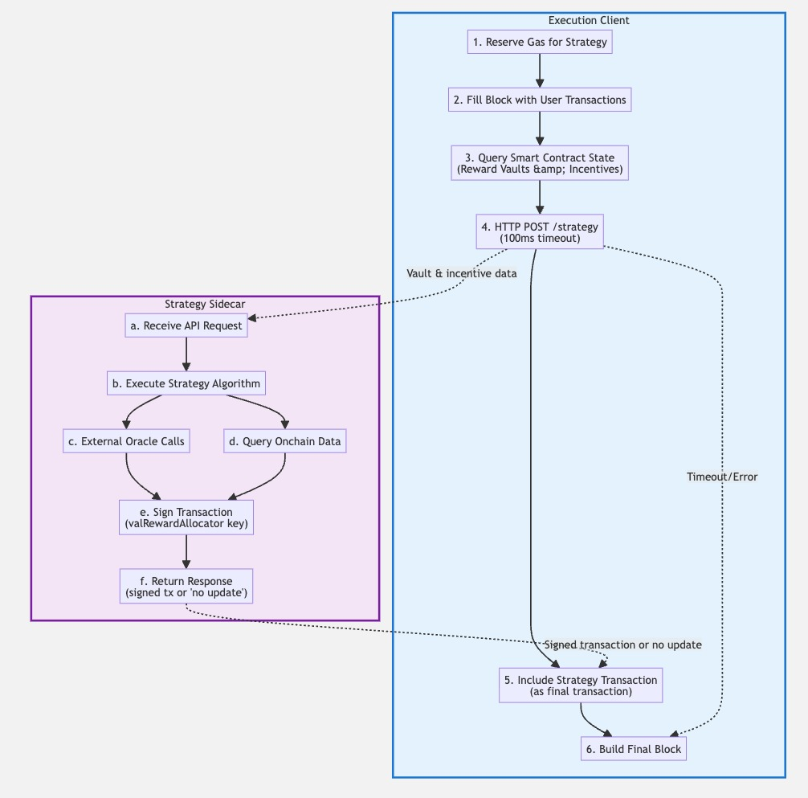

## Summary

This BRIP proposes an optional default strategy for validators to automatically optimize BGT (Bera Governance Token) distribution through their cutting boards. The strategy integrates directly with execution clients to access real-time smart contract state data and leverages a sidecar service to compute optimal distribution strategies. This reduces the technical sophistication required for validators to participate effectively in Proof of Liquidity while enabling more efficient exchange of incentives for BGT.

This proposal depends on the real-time cutting board execution enabled by BRIP-0004, which eliminated the cutting board queue delays.

## Motivation

While BRIP-0004 enables real-time BGT distribution, validators must still manually configure their cutting boards to optimize BGT allocation. This requires deep technical knowledge of incentive markets and constant monitoring to maximize returns. An automated default strategy reduces these barriers by providing algorithmic optimization while preserving validator choice through an opt-in system.

## Specification

### Overview

The default strategy operates as an opt-in system where validators can configure their execution client to communicate with a sidecar container that provides strategic decision-making via an API.

The execution client partially builds blocks, queries the current incentive state, requests strategy decisions from the sidecar, and includes the resulting cutting board update transaction as the final transaction in the block.

### Architecture Components

#### 1. Execution Client Integration

**Configuration Parameters:**

The specific configuration format and parameters are left to execution client implementers, but should include at minimum:
- Strategy service endpoint URL
- Request timeout settings
- Gas limit reservations for strategy transactions

**Block Building Integration:**

The execution client modifies its block building logic to:

1. Reserve gas for strategy transaction
2. Fill block with user transactions up to gas limit minus reserved amount
3. Query current incentive state from smart contracts
4. Make HTTP request to sidecar with 100ms timeout
5. If sidecar responds with signed transaction, append it as final transaction
6. If timeout or error, build block without strategy transaction

#### 2. State Query Interface

The execution client sends vault data to the sidecar:
- Current cutting board configuration
- Available vaults with APR and incentive amounts
- Block metadata (number, timestamp, gas price)

**Important:** The query interface should be designed to dynamically discover all reward vaults from on-chain state, eliminating the need for execution client updates when new vaults are added to the protocol.

#### 3. Sidecar API Interface

**Endpoint:** `POST /strategy`  
**Request:** JSON with current cutting board and vault data (TODO: Define complete request schema with all appropriate information, consult SC team)  
**Response:** `{"updateRequired": false}` or `{"updateRequired": true, "signedTransaction": "0x..."}`

#### 4. Default Strategy Algorithm

The default strategy should calculate distribution to maximize the highest USD value of incentives, fetching prices from offchain oracles or onchain data as needed to determine optimal allocation.

TODO: Define more concretely.

#### 5. Sidecar Implementation Requirements

**Sidecar Requirements:**

- Manages private key for signing cutting board transactions
- Implements strategy algorithm (to be specified)
- Responds within 100ms timeout
- Checks `valRewardAllocator` wallet has sufficient gas tokens before signing
- Returns signed transaction or "no update" (including when insufficient gas)

#### 6. Private Key Management

BRIP-0004 introduced the `valRewardAllocator` role separation for cutting board management, allowing the use of a hot key (`valRewardAllocator`) for frequent strategy updates while maintaining cold key (`operator`) control. The sidecar is responsible for:
- Securely storing the `valRewardAllocator` private key (implementation methods left to implementers, ranging from environment variables to key management services)
- Signing transactions with appropriate nonce and gas price settings
- Managing key rotation when needed

If the `valRewardAllocator` key is compromised, the worst case scenario is temporarily distributing BGT to unintended reward vaults until the validator can revoke the compromised key using their `operator` key and designate a new `valRewardAllocator`.

### Assumptions and Limitations

#### Block Builder Assumption

This proposal assumes the block builder and block proposer are the same entity. This is a two-way door decision that can be modified in future without consensus changes if block building becomes separated from proposing.

#### State Visibility Limitations

Strategy decisions are based on state after partial block building to prevent incentives from being removed at the last second before distribution. The strategy transaction is placed as the final transaction in the block to ensure state consistency.

## Rationale

### Design Decisions

#### Execution Client Integration

Direct integration with execution clients is necessary because:

1. **State Access**: Only execution clients have access to smart contract state during block building
2. **Transaction Ordering**: Strategy transactions must be placed as the final transaction in blocks because until that point, other transactions could be included that could affect the state of incentives

#### Sidecar Architecture

Separating strategy logic into a sidecar provides:

1. **Flexibility**: Easy updates to strategy algorithms without execution client changes
2. **Maintainability**: Strategy logic can be developed and tested independently, and the same sidecar can be used for both bera-geth and bera-reth, reducing duplicate implementations

#### Synchronous API Calls

The synchronous API design ensures:

1. **Deterministic Timing**: Block building doesn't proceed until strategy decision is made, or timeout is reached
2. **State Consistency**: Strategy decisions are based on the exact partial block state
3. **Simplified Implementation**: Avoids complex asynchronous coordination

### Alternative Approaches Considered

#### Completely Out-of-Protocol Solution

- Issues with getting transactions included when intended due to gas competition
- Cannot access world state when determining strategy, leading to suboptimal decisions based on stale data

#### Block Builder Integration (e.g., rbuilder)

- Large operational overhead for validators
- rbuilder only works with Reth, limiting execution client choice

## Backward Compatibility

This proposal is fully backward compatible:

1. **Opt-in Design**: Validators must explicitly enable the strategy feature
2. **No Protocol Changes**: No changes to consensus rules or transaction validation
3. **Existing Clients**: Unmodified execution clients continue to work normally
4. **External Strategies**: Existing external cutting board management solutions continue to function

## Security Considerations

### Private Key Management

- **Key Separation**: Strategy keys leverage the operator separation from BRIP-0004, allowing hot wallet usage for cutting board updates while cold wallet retains ultimate control
- **Compromise Response**: Clear procedures for handling compromised strategy keys

### API Security

- **Local Access Only**: Sidecar APIs should only accept connections from localhost by default
- **Authentication**: Consider implementing API authentication for additional security (TODO: Decide auth mechanism, e.g. JWT)

## Copyright

All copyrights and related rights in this work are waived under CCO 1.0 Universal.