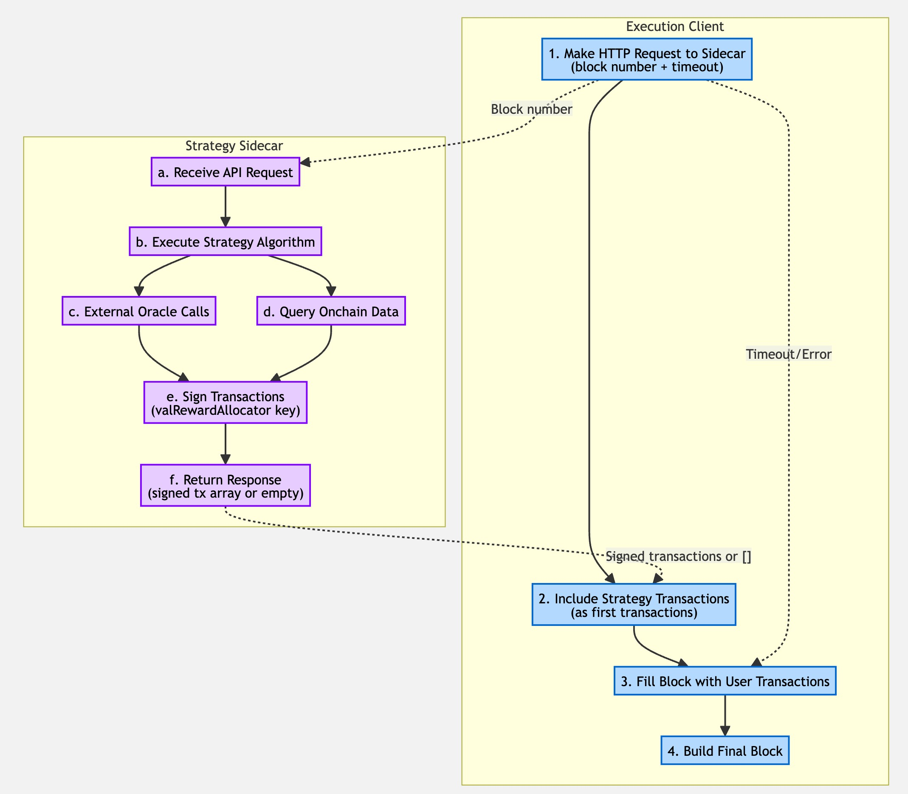

## Summary

This BRIP proposes an optional default strategy for validators to automatically optimize BGT (Bera Governance Token) distribution through their cutting boards. The strategy leverages a sidecar service to compute optimal distribution strategies based on its own data sources. This reduces the technical sophistication required for validators to participate effectively in Proof of Liquidity while enabling more efficient exchange of incentives for BGT.

This proposal depends on the real-time cutting board execution enabled by BRIP-0004, which eliminated the cutting board queue delays.

## Motivation

While BRIP-0004 enables real-time BGT distribution, validators must still manually configure their cutting boards to optimize BGT allocation. This requires deep technical knowledge of incentive markets and constant monitoring to maximize returns. An automated default strategy reduces these barriers by providing algorithmic optimization while preserving validator choice through an opt-in system.

## Specification

### Overview

The default strategy operates as an opt-in system where validators can configure their execution client to communicate with a sidecar container that provides strategic decision-making via an API.

The execution client builds blocks and requests strategy decisions from the sidecar, including the resulting cutting board update transactions as transactions in the block.

### Architecture Components



#### Constants and Variables

| Variable | Value | Description |
|----------|-------|-------------|
| `SIDECAR_REQUEST_TIMEOUT` | TBD | Maximum time in milliseconds for sidecar API requests before timeout |

#### 1. Execution Client Integration

**Configuration Parameters:**

The specific configuration format and parameters are left to execution client implementers, but should include at minimum:
- Strategy service endpoint URL
- Request timeout settings
- Gas limit reservations for strategy transactions

**Block Building Integration:**

**Block Building Integration:**

The execution client modifies its block building process to:

1. Make HTTP request to sidecar with current block number and `SIDECAR_REQUEST_TIMEOUT`
2. If sidecar responds with signed transactions, include them as the first transactions in the block
3. If timeout or error, build block without strategy transactions
4. Fill remaining block space with user transactions from the pool

#### 2. Sidecar Data Management

The sidecar is responsible for maintaining its own data sources and state information. The execution client only provides the current block number to allow the sidecar to determine if its internal state is current or stale.

#### 3. Sidecar API Interface

**Endpoint:** `POST /strategy`

**Request:**
```json
{
  "blockNumber": 12345
}
```

**Response:**
```json
{
  "signedTransactions": ["0x...", "0x..."]
}
```

Note: The `signedTransactions` array may be empty if no strategy updates are needed.

#### 4. Default Strategy Algorithm

The default strategy should calculate distribution to maximize the highest USD value of incentives, fetching prices from offchain oracles or onchain data as needed to determine optimal allocation.

TODO: Define more concretely.

#### 5. Sidecar Implementation Requirements

**Sidecar Requirements:**

- Manages private key for signing cutting board transactions
- Maintains own data sources for incentive information, vault data, and pricing oracles
- Uses block number from request to determine if internal state is stale
- Implements strategy algorithm (to be specified)
- Responds within `SIDECAR_REQUEST_TIMEOUT`
- Checks `valRewardAllocator` wallet has sufficient gas tokens before signing
- Returns array of signed transactions (may be empty)
- Caches responses for duplicate requests with short TTL (e.g. 1 minute)

**Data Requirements:**
- All sidecar data must be deterministic based on blockchain state
- No requirement for execution client to provide incentive or vault data
- Sidecar responsible for discovering and tracking reward vaults

#### 6. Private Key Management

BRIP-0004 introduced the `valRewardAllocator` role for cutting board management, enabling hot key usage while maintaining `operator` cold key control. The sidecar manages the `valRewardAllocator` private key, signs transactions, and handles key rotation as needed.

If compromised, the worst case is temporarily distributing BGT to unintended vaults until the `operator` key revokes and replaces the `valRewardAllocator`.

## Implementation Plan

### Phase 1: Simple Block Number Request

**Scope:** Basic strategy integration with minimal execution client changes

**Features:**
- Sidecar request contains only block number for stale state detection
- Sidecar maintains its own data sources (incentive data, vault information, pricing)
- Response can include multiple signed transactions
- Strategy transactions placed as first transactions in the block
- Simpler backend service requirements
- Edge case: Incentives removed in same block by later transactions (acceptable for Phase 1)

**Benefits:**
- Faster time to market with simpler implementation
- Reduced execution client modifications
- Proves viability of sidecar architecture

### Phase 2: Enhanced Block Context (Future)

**Scope:** Advanced strategy optimization with partial block execution context

**Features:**
- Execution receipts of partially executed block included in sidecar request
- Strategy decisions can account for actions within the current block
- Strategy transactions executed at the end of the block for maximum state visibility
- Reduces scope of potential incentive manipulation attacks
- Enhanced decision-making capabilities

### Assumptions and Limitations

#### Block Builder Assumption

This proposal assumes the block builder and block proposer are the same entity. This is a two-way door decision that can be modified in future without consensus changes if block building becomes separated from proposing.

#### State Visibility Limitations

Strategy decisions are made without visibility into the current block's transactions. This creates edge cases where incentives could be removed by later transactions in the same block.

## Rationale

### Design Decisions

#### Execution Client Integration

Direct integration with execution clients is necessary because:

1. **Transaction Ordering**: Strategy transaction placement within blocks can be controlled granularly to ensure deterministic execution
2. **Block Building Control**: Only execution clients can control transaction inclusion order and timing during block building

#### Sidecar Architecture

Separating strategy logic into a sidecar provides:

1. **Flexibility**: Easy updates to strategy algorithms without execution client changes
2. **Maintainability**: Strategy logic can be developed and tested independently, and the same sidecar can be used for both bera-geth and bera-reth, reducing duplicate implementations

#### Synchronous API Calls

The synchronous API ensures deterministic timing (block building waits for strategy decision or timeout) and enables the sidecar to detect stale state through block number comparison.

### Alternative Approaches Considered

#### Completely Out-of-Protocol Solution

- Issues with getting transactions included when intended due to gas competition
- Cannot access world state when determining strategy, leading to suboptimal decisions based on stale data

#### Block Builder Integration (e.g., rbuilder)

- Large operational overhead for validators
- rbuilder only works with Reth, limiting execution client choice

## Backward Compatibility

This proposal is fully backward compatible through its opt-in design with no consensus changes required. Existing execution clients and external cutting board solutions continue to function normally.


## Security Considerations

### Private Key Management

- **Key Separation**: Strategy keys leverage the `valRewardAllocator`/`operator` separation from BRIP-0004
- **Compromise Response**: Clear procedures for handling compromised strategy keys

### API Security

- **Local Access Only**: Sidecar APIs should only accept connections from localhost by default
- **Authentication**: Consider implementing API authentication for additional security
- **Input Validation**: All sidecar inputs should be validated
## Copyright

All copyrights and related rights in this work are waived under CCO 1.0 Universal.