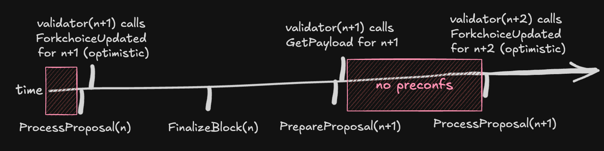

# Berachain Preconfirmations


## Summary

We present a technical architecture and design for a pre-confirmation system on Berachain that can realize significantly reduced inclusion latency for the majority of our users. The design provides an opt-in fast path for users who are willing to relax their trust requirements without reducing the safety guarantees provided by the current consensus mechanism.

## Introduction

The key software components of this design:

- **Sequencer:** A component responsible for creating partial blocks that act as pre-confirmations, while also providing the full block to validators when required for CometBFT consensus. Built as an optional extension on Bera-Reth.
- **RPC nodes:** A modified execution client on Bera-Reth capable of receiving partial blocks, verifying their validity, then applying and serving the pre-confirmed state through the public APIs.
- **Beacon-Kit:** A customized consensus client capable of requesting payloads for proposal from the external sequencer, while also using its own execution layer as a fallback. For the sequencer, their instance of Beacon-Kit also requests blocks on behalf of the next proposer, validating their participation in the pre-confirmation network.

## Motivation

The key motivations of this design are:

### Liveness

The proposed architecture is optimized for performance. If any component within the pre-confirmation system fails, the chain should smoothly transition to its default block building mechanism with the usual 2 second block time. This relaxes availability requirements of the sequencer.

### Consistency

Efforts will be made to ensure that pre-confirmed state is that which eventually gets finalized. However, disaster scenarios may lead to rare perceived inconsistencies. Applications that cannot tolerate such inconsistencies, e.g. CEXs, may find it suitable to avoid pre-confirmations.

### Operation

The proposed architecture aims to minimize operational load on existing validators by repurposing existing software rather than introducing new binaries that need to be run alongside Beacon-Kit and Bera-Reth/Geth.

### Trust Assumptions

To those relying on pre-confirmations, the sequencer and validator for the pre-confirmed blocks are trusted entities, as both are expected to co-operate. If either party is untrusted, the pre-confirmation is unreliable. Therefore, validators involved in the pre-confirmation network should be evaluated before acceptance.

## Specification

### Architecture

#### Sequencer

This is the entity responsible for creating and distributing pre-confirmed partial blocks.

It has a few key roles and software components with a pipelined architecture.


##### State Management

When the Sequencer is not actively building the next block, it needs a mechanism to stay synchronized with the chain. By building the sequencer as an add-on for Bera-Reth, we can avoid building our own block synchronization mechanism, an edge over other solutions.

Initially, all state relevant to partial blocks will be kept in memory. This is fine because partial block state becomes stale very quickly (2s block time) and is bounded in size.

All state required for reading will be available from the Bera-Reth database.

##### Building Partial Blocks

The Sequencer will only begin partial blocks when Forkchoice Attributes are provided from Beacon-Kit, indicating that the next block is from a proposer whitelisted for pre-confirmations. This requires changes in Beacon-Kit, discussed later.

The attributes consist of the same fields as currently present, i.e. all the information necessary to produce the block:

```jsx
timestamp
prev_randao
suggested_fee_recipient
withdrawals
parent_beacon_block_root
prev_proposer_pubkey
```

The sequencer will then:

1. Validate that the received `forkchoiceUpdated` head is the head of the sequencer. If it is not the head, then the Sequencer is not at the canonical state and will skip providing pre-confirmations for this block. The system should self-repair as Bera-Reth will sync to the proper head from peers through existing mechanisms.
2. Apply the top of block state transitions, including beacon_root, block hashes contract call, and PoL Tx to an in-memory cache of state
3. Transactions are executed in parallel and ordered for valid inclusion in the next partial block. This also involves capturing the execution result of the transactions. Transactions with conflicting state access are shuffled back to the mempool. Parallel execution is not needed for initial iterations till we see higher throughput.
4. Once the partial block duration has passed (200ms), the partial block is *sealed.* This sealed block consists of the following:
    - *Block Number*
    - *Partial Block Index*
    - *Encoded Transactions*
    - *Boolean indicating if it is the last partial block*
    - *Sequencer Signature over the payload*
5. The sealed block is propagated by direct calls to the `preconf_newPartialBlock` websocket API on configured RPC nodes. This could be extended to a gossip mechanism in the future for further scalability.
6. Steps 3-5 continue until the block gas limit is reached or until `engine_getPayload` is called. Once `engine_getPayload` is called, we seal the final partial block and broadcast it, while also calculating the state, receipt, and transactions root to form the correct full block for CometBFT proposal.

##### Mempool

Transactions are sourced from the Bera-Reth mempool. This mempool will be customized for the sequencer and will also accept transactions directly from RPC nodes and not just via P2P gossip. This will require additional checks to avoid sequencer spam, potentially starting with a trusted source.

Customizations are further required as pending transactions must be removed as partial blocks are built, as partial blocks may invalidate transactions in the mempool due to invalid nonces.

#### RPC Nodes

These RPC nodes run Bera-Reth with additional optional add-ons that allow them to consume and serve partial blocks from the sequencer.

##### Partial Block Validation

RPC nodes will serve the new API `preconf_newPartialBlock`, that is accessible from a websocket stream. This is how the sequencer will inform them of new partial blocks.

RPC nodes are configured with the public key of the well-known sequencer, and any received signed partial block is validated for its signature.

If the RPC node is at the correct block height, the partial block is then re-executed against the current state for validity and stored in-memory.

APIs for relevant methods including those below are overridden such that if pre-confirmed state is available, it is served.

```jsx
eth_getBalance
eth_getTransactionCount
eth_estimateGas
eth_getBlockByNumber
eth_gasPrice
eth_getTransactionReceipt
```

##### Partial Block Reorgs

Partial blocks could be reverted in disaster scenarios. Given this, the partial block state is only persisted in-memory and removed whenever a new head is received, where new heads received through fork choice updates always take precedence.

#### Beacon-Kit

Most other pre-confirmation solutions require middleware between the execution layer and the consensus layer. Since we control the consensus layer, we can leverage alternative design patterns.


##### Proposer Validation

In the current design, the execution layer of the sequencer is not validating or aware of the identity of the next proposer.

This requirement is deferred to Beacon-Kit, such that anytime the sequencer's instance of Beacon-Kit requests payload building through `forkchoiceUpdate` requests, it can be assumed that Beacon-Kit has validated that the next proposer is part of the pre-confirmation network set.

Inclusion into the pre-confirmation set could be a configured list of validator public keys that the sequencer's Beacon-Kit will check against before triggering payload building.

For validators operating Beacon-Kit that are part of the pre-confirmation network, they will preference payloads fetched from the sequencer via `GetPayload`, but will also validate such payloads against local state by calling `NewPayload` on the local execution client state.

##### Fallback Building

This is when Beacon-Kit will use its own execution client for the next proposal, ignoring the sequencer.

Trigger Conditions:

1. Sequencer provides an invalid full block
2. Sequencer not in sync with chain tip
3. GetPayload timeout

Fallback building should be avoided as it is effectively a pre-confirmation reorg.

### Limitations

In this design, there is a period of time between `PrepareProposal` and `ProcessProposal` during which no pre-confirmations are created.



This is because the trigger for pre-confirmation creation is a `forkchoiceUpdated` request which only happens during `ProcessProposal` when a node is running optimistic payload building in Beacon-Kit.

Theoretically, if there is a contiguous set of upcoming proposers who are participating in pre-confirmations, this could be optimized.

## Security Considerations

- Sequencer Private Key Leak
    - In this scenario, a Byzantine sequencer could trick RPC nodes into serving state that is likely to get reorged. RPC nodes will need to update their configuration for the new sequencer public key.

## Adoption Plan

**Phase 1:**

- Select validators chosen to opt-in.
- Pre-confirmed state only served through dedicated pre-confirmation RPC endpoints from self-hosted RPC nodes

**Phase 2:**

- Wider validator rollout
- Pre-confirmed state only served through dedicated pre-confirmation RPC endpoints from self-hosted RPC nodes

**Phase 3:**

- Most validators involved
- Pre-confirmed state served through standard RPC endpoints